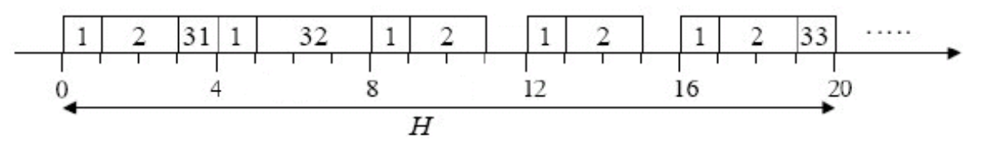

# scheduler-clockdriven
Implementation of a real time scheduling that allows you to run a set of periodic tasks according to a clock driven approach, using a static scheduling algorithm that provides the system with a feasible schedule, if it exists

Of each task τi are known (Ci, Di, Ti) therefore, through the scheduling algorithm, we can calculate a static schedule a priori characterized by:
- The value of the hyperperiod H;
- The frame period m;
- The sequence of tasks to be performed in each frame.

The cyclical schedule that is assigned can be used to execute in the order just do the tasks within the frames (executive).
The executive is developed to wake up only at the beginning of each frame to perform the following actions:
- Run the periodic tasks of the next frame in the right order;
- Check that the periodic tasks of the previous frame have ended;
- Manage the execution of aperiodic tasks avoiding interference with the cyclical schedule;
- Detect and report any deadline miss.

## Example 
The tasks τ1, τ2, τ3 are given (τ3 has been partitioned into 3 sub-tasks):
- τ1 = (4, 1, 4)
- τ2 = (5,2,7)
- τ3,1 = (20,1, 20)
- τ3.2 = (20.3.20)
- τ3.3 = (20.1.20).

The proposed cyclical schedule can be graphically represented as follows:

The information necessary for the executive to manage the activation of the tasks is as follows: 
- H = 20;
- m = 4;
- F1 = {τ1, τ2, τ3,1} 
- F2 = {τ1, τ2}
- F3 = {τ1, τ3,2}
- F4 = {τ1, τ2}
- F5 = {τ1, τ2, τ3.3}.

## Aperiodic task and slack stealing
The system also allows scheduling of an aperiodic task, the release of which occurs sporadically during system operation. To minimize the average response time of the aperiodic (hypothetical) task, a slack-stealing policy will be used, using the slack time units available in the individual frames to perform the aperiodic task before the periodic tasks to be released in the frame itself.
